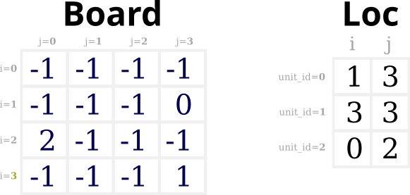
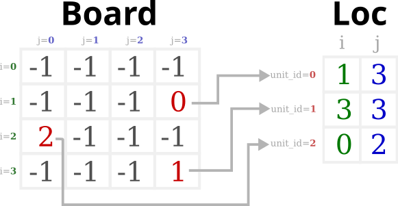
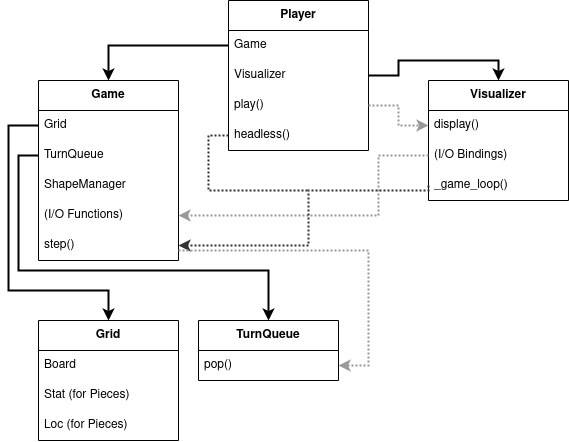

## 1. Introduction

### _1.a Overview_

Welcome to the Meshgrid environment! Meshgrid is a duck-typed game engine. As such, the exact code specification for the engine is less important than its design, and the tests defining what constitutes a properly functioning version of the engine. For those without a Computer Science background, duck-typing follows the adage that "if it walks like a duck and quacks like a duck, then it must be a duck!" Defining a game engine in this way frees programmers to write versions of Meshgrid for any particular platform, with a reasonable expectation that they'll play identically (framerate permitting). It could run within another game engine, such as Godot or Phaser. It could run within a Jupyter Notebook. It could even run on a chess board with custom pieces and some human hands to implement the rules. Subsequently this also implies that any game built entirely on the Meshgrid engine would be just as portable to other platforms as the core engine itself.

This project is still very early in development, so much of the grandeur of the previous paragraph would be somewhat difficult to achieve for now. However, even in its current state, it would be useful for two purposes: game prototyping and machine learning. A pure-python Jupyter Notebook version of the Meshgrid engine, alongside a minimalist canvas-based visualizer, constitute the first implementation of the engine.

### _1.b How To Use It_

Check out the `meshgrid.ipynb` tutorial notebook for examples of how Meshgrid can be used in Jupyter notebooks!

## 2. Code

### _2.a Overview_

Most of the package's structures revolve around wrapping Grid objects, and adding game I/O and visualizations to the components of Grid objects. A "Grid" itself is generally defined as being a collection of "Pieces" with a "Board". The pieces have a location and may also have game stats associated with them:

 

 

A game typically will have just one Grid object, but it is entirely possible to use more than one Grid object in a game, or use a Grid object that has more than one "layer" by using a Multilayer Grid. Currently all Grid objects use Square Boards, but future implementations will include the option for Hexagonal Boards as well.

### _2.b Board & Loc_

The Board itself is represented as a 2D array of squares. The ID of each piece is written into the square on the board where the piece is located (with empty squares represented by `-1`). The Loc and Stats objects are also 2D arrays, where the first index is the piece's "unit ID". Loc holds the location of the piece on the board, but in `(i,j)` coordinates. This implies that you can find the location of a piece in two ways: by finding the piece's ID on the Board, or by looking at the `(i,j)` value for that piece in Loc. See the diagram below (with row and columns given descriptors in gray for clarity):

 

 

Here's the same image with some highlighting to make it clearer what numbers are `unit IDs` (red), and what numbers are `i` (green) and `j` (blue) coordinates:

 

 

By tracking the piece location in two ways (via Board and Loc), it offers some convenience in checking if pieces are adjacent to other pieces (by making it an _`O(1)`_ lookup on the Board) while still making it easy to find a piece's `(i,j)` location by ID (an `O(1)` lookup in Loc) or to loop through all pieces (by looping over the first dimension of Loc or Stats).

Grid object functions that move pieces will update both Board and Loc (but never Stats!) If you plan to update Board manually then it is recommended you call the grid function `rebuild_loc_from_board()` to update Loc accordingly. Likewise, if you plan to update Loc manually then it is recommended you call the grid function `rebuild_board_from_loc()` to update the Board accordingly. In this way, you can use Grid object piece-moving functions, or update Board or Loc directly yourself to move pieces around. In general the Meshgrid game engine aims for flexibility and ease of use whenever possible. Do note that since this is an early version of the engine, it may still be a little tricky to use!

### _2.c Class Diagram_

Sincere there are many classes to accomplish the wrapping of Grid objects so they can interact with input devices like keyboards and output devices like your monitor, below is a simplified class diagram highlighting important components and how they interact:

To avoid confusion, here are explicit definitions of some of the terms above:
* **Player** - A class that can let you `play()` the game with game I/O and a visualization (not to be confused with a _human_ player). A player can also run the game in `headless()` mode, which plays the game without any visualizations or I/O from humans.
* **Visualizer** - A class that manages visualizing the game and catching keyboard/joystick/mouse I/O and passing it to the Game. There will be one Visualizer per platform (eg: Jupyter Notebook, PyGame, Godot, etc.). Because the visualizer ingests game input and output, it also runs the Game's main `_game_loop()` using functions from within the Game, including `step()` which is where game updates actually occur.
* **Game** - A game will include _all_ game artifacts (game Board, Pieces, and extra artifacts such as cards, Board-external items, etc.), and I/O functions (eg: function calls that alter the game when the player presses buttons or uses their mouse). Games will also include a `step()` function that is called at a fixed number of frames (where frames are measured in frames-per-second, or FPS).
* **Grid** - A grid includes the Board and all the game Pieces that can be placed on the Board. It also includes a suite of helper-functions to help manage the Board and its Pieces.
* **Board** - An array of squares (like a chess board), hexes, etc. where Pieces are placed. It keeps information about pieces at specific locations.
* **Piece** - Something placed on to the board at a certain location, which also includes Stats that affect gameplay. Pieces don't exist as a separate class, but are defined by their Loc and Stat values.
* **Stats** - Statistics for each game piece (eg: shape, orientation, alive vs dead, HP, etc.), arranged into a single array.
* **Loc** - Location vectors for each piece, arranged into a single array.

### _2.c Future Features_

Future features are classified by feature type, and given in no particular order of priority:

* Grid Additions
    * Hexagonal grids!
    * DAG "grids" (aka, pieces in your game move between nodes connected by edges), like the board for Pandemic
    * "Scrolling" grids, where the world is larger than what you can see, like Dwarf Fortress or Crypt of the Necrodancer
* Platform Portability
    * Numba Port (Early indications are that we may see ~40x speedup in headless mode) for ML purposes
    * PyGame Port because we already have a pure-python version
    * Godot Port for convenient implementation of gameplay experiments for indie games
    * Phaser Port for convenient implementation of gameplay experiments for web games
* Codebase Changes
    * Update to a conda or poetry environment (consider `cookiecutter-poetry`) & CI
    * Push to Conda Forge (possibly via `rever`)
    * Linting / formatting / complete typing on all functions & classes
    * Sphinx docs
    * Contributor guidelines
    * Upgrade tests to check multiple python versions via `tox` (& consider a `pytest` port)
    * Dockerized Jupyter notebook via a `make` command (to ease compatibility)
    * Enumeration of valid coding primities for writing games (to ease game portability)
    * Hook up to code translation systems to accelerate game porting
* Codebase Additions
    * Bitmaps, and not just colored squares
    * Functions to "paint" grids with values, and not just place pieces
    * Menus and other clickables that aren't Grid objects
    * A* and other baked-in pathing features
    * Line-of-sight, cone-of-sight, and other useful helper functions for visibility checks
    * "Server mode" to expose an API to a headless game instance
* Sample Game Additions
    * Match-3 style games
    * Sokoban games
    * Block-sliding puzzles (like the Princess-in-a-box level from the first Professor Layton game)
    * Sudoku-like games

## 3. Acknowledgements

Starting with a port to Jupyter Notebooks was partly inspired by the following blog post: https://blog.jupyter.org/jupyter-games-cda20dc15a21. The name for the engine itself is a reference to Numpy's `meshgrid()` function, which conveniently gives back the coordinates of an n-dimensional grid for all cells at once.